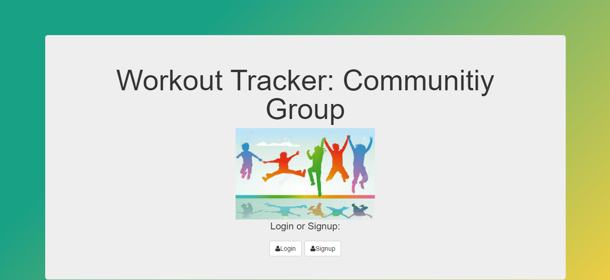

# My Workout Tracker Project
This project shows a user friendly way to share your own  personal workout journey with friends and family in your community. You can utilize this application to support and also use the ideas and journey of others for motivation.

## How It's Made:

**Tech used:** HTML, CSS, JavaScript, Node.js, MongoDb

I utilized my skills in javaScript, HTML and CSS to capture an inviting application for users. I also utilized Mongo.Db and Node.js to serve up information to a user after they send a request to my server. I am able to view and manipulate(delete) users information as they provide it.

## Lessons Learned:
I learned to store users information in my database which proved to be beneficial. This acted as a guide in seeing that information was accessed and provided efficiently.